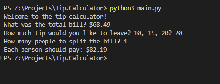

# Welcome to Tip Calculator


# Steps to clone this project

1. Clone Repository
    ```sh
    git clone https://lab.skynetinc.tech/WorldDrknss/Tip.Calculator.git
    ```

2. `cd` into the cloned repository
    ```sh
    cd Tip.Calculator
    ``` 

3. Launch Tip Calculator
    ```sh
    python3 main.py
    ```

# Technologies 🔥

This project is built using Python.
  
# Objective‼

To create a base starting point for entry level python development.
# Features ✨
Utilizes float values and user inputs to calculator tip and has the ability to split costs.